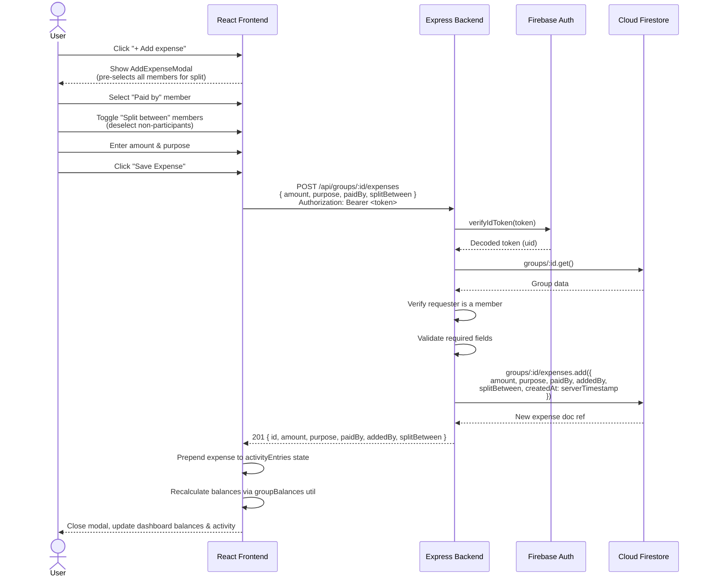
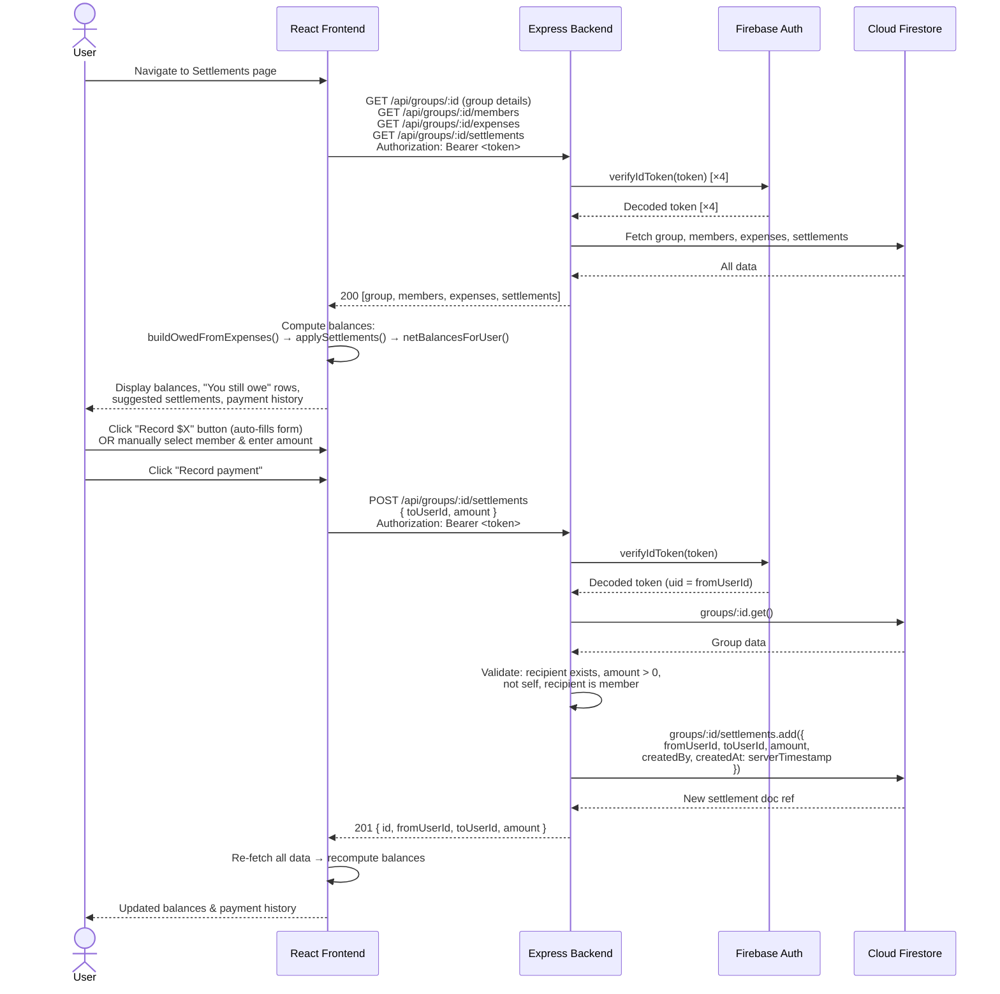
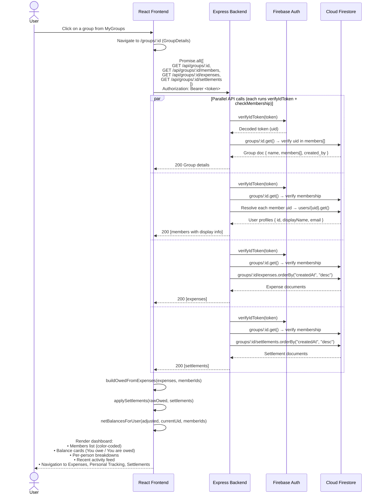

## What is endetted?
endetted is a web-based solution that allows you to split payments between a group of friends if you have shared expenditures. If you ever go out on a trip with friends and agree to split costs, you would normally have to write down expenditures on notes, constantly ensure it is up to date, debate over the history of who went where, and log any settlements that have been made during or after the trip. However, with Endetted, all of these tedious clerical tasks will be done automatically for you!

## How do you use it?
After logging in to an account (or signing up for one), you can select "create group" to create a new group. Within that new group, you first need to search up and add all of the people that you are travelling with into your group. 

After your group is set up, you can log a purchase. Selecting all relevant group members and writing down the payment details will let the software automatically divide the costs among your group members and update each person's balance sheet accordingly. 

### Other Features:
- **Selective splitting**: if several people from a group are not involved in a particular purchase, you can remove them from that particular payment, so the costs are split among the relevant group members. 
- **Purchase logging**: Keep a comprehensive and adjustable history of every purchase the group made, with a separate feature logging your own purchases for the group
- **Payment settlement logging**: Logs final payments between group members when settling final balances. 

## Installation & Setup
Before setting up the program, ensure you have the following dependencies installed on your system:
npm version 11.12.1
Node version 24.x

First clone the repo
`git clone https://github.com/NathanYJiang/CS35L.git`

Then simply run from the repo's root folder
`cd CS35L
npm run dev`

You may need to install dependencies, do so with
`npm install`

Dependencies may also need to be installed both the frontend and backend separately
`cd frontend
npm install`

`cd ..`

`cd backend
npm install`

To ensure the system operates properly, run `npm run test`

## UML Entity-Relation diagram

!(docs/erDiagram.png)

## UML Sequence Diagrams

Below are sequence diagrams for the core flows in endetted. Each diagram shows the interaction between the **User**, **React Frontend** (browser), **Express Backend** (Node.js server), **Firebase Auth**, and **Cloud Firestore**.

---

### 1. Add an Expense (Selective Split)

---

### 2. Record a Settlement Payment

---

### 3. View Group Dashboard (Data Aggregation)

